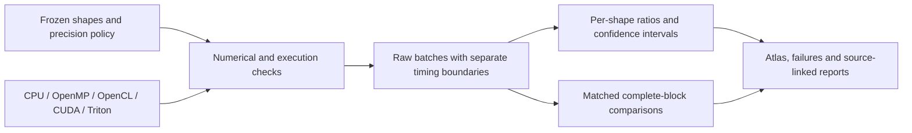

# groupconv-atlas

*Measure where the kernel wins, and whether the block keeps the gain.*

> 逐形状量清内核在哪里变快，再检查收益能否留在完整模块里。

[](https://github.com/LucisZhang/groupconv-atlas/actions/workflows/cpu.yml)

## Why this exists · 为什么做

**GroupConv Atlas** asks when a custom grouped-convolution kernel is worth using.
The work spans four CUDA implementations, CPU/OpenMP and Apple OpenCL references,
a Triton subset, and a measurement pipeline that keeps complete outputs, raw timing
batches, unsupported shapes and losing results together. The central finding is
mixed: register reuse improves the direct CUDA baseline, while tuned PyTorch
remains faster across the full Atlas.

> GroupConv Atlas研究自定义分组卷积内核何时值得使用。项目实现并比较四个CUDA版本，配套CPU/OpenMP、Apple OpenCL参考和Triton子集，把完整输出校验、原始计时批次、不支持项与退化结果放进同一套实验。主要发现并不单向：寄存器复用改进了直接CUDA实现，但在完整Atlas上仍未超过调优PyTorch。

## Quickstart · 快速开始

From a clone of this public repository, the first command needs only Python 3.9+.
It checks published file hashes and recomputes batch medians, per-shape ratios and
aggregate ratios from **129,000 raw samples**. It does not rerun the GPU or
independently regenerate the bootstrap intervals.

> 克隆这个公开仓库后，第一条命令只需Python 3.9+：它核对文件哈希，从129,000条原始样本复算批中位数、逐形状比值与汇总比值。GPU实验与bootstrap区间的重新生成属于另外的流程。

```sh
python3 scripts/audit_public_evidence.py --root . --require-license

# CMake 3.20+, C++17, and an OpenMP runtime
./run.sh cpu
ctest --test-dir build --output-on-failure
```

On macOS, `run.sh` selects Homebrew LLVM/libomp when available. CPU CI runs native
correctness plus AddressSanitizer and UndefinedBehaviorSanitizer. Real GPU execution
needs the matching hardware and dependencies; the archived results can be checked first.

> macOS下，`run.sh`会选用已安装的Homebrew LLVM/libomp。CPU CI另跑内存与未定义行为检查。Python输出检查与GPU重跑需要对应依赖和设备，见[验证指南](docs/execution/cuda-validation.md)、[macOS依赖记录](requirements-lock.txt)和[Linux CUDA依赖](requirements-cuda.txt)。

## Headline · 核心结果

The current **RTX 4090** Atlas covers **80 shapes × 6 implementations**:
**430 PASS, 50 UNSUPPORTED**, with **10 batches × 30 samples** per supported row.
All unsupported rows belong to k2's declared subset. The primary geometry is FP32,
contiguous NCHW, equal input/output channels, 3×3, stride/dilation 1, padding 1 and no bias.
<!-- src: configs/atlas.json; results/rtx4090/session-20260908-vast-03/analysis-atlas/analysis.json -->

> 本轮RTX 4090覆盖80个形状、6个实现，共430 PASS、50 UNSUPPORTED；每个支持项采集10批、每批30个样本。不支持项全部来自k2的声明范围。主表固定FP32、连续NCHW、输入输出通道相等、3×3、步长与膨胀率1、填充1、无bias。

| Comparison / 对照 | Graph device / 图内设备 | Synchronized API / 同步调用 |
| --- | ---: | ---: |
| Direct CUDA k0 / custom k3 | **3.8718×** | **3.4490×** |
| Tuned PyTorch / custom k3 | **0.7384×** | **0.6448×** |
| MobileNetV2 block, original / substituted, N=4 | **1.13849×** | **0.67902×** |

Ratios are **baseline latency ÷ candidate latency**; values above one favor the
candidate. The first two rows are geometric means over all 80 shapes, using the
ratio of each shape's median batch medians. The third is one complete,
random-weight block with a single convolution replaced.
[Atlas results](results/rtx4090/session-20260908-vast-03/analysis-atlas/analysis.json) · [block results](results/rtx4090/session-20260908-vast-03/analysis-supplemental/module-n4.json).

> 比值为基线时间除以候选时间，大于1表示候选更快。前两行对80个形状取几何平均；每个形状先取批中位数的中位数，再求基线／候选比值。第三行测的是随机权重的完整MobileNetV2模块，仅替换其中一个卷积。[Atlas数值](results/rtx4090/session-20260908-vast-03/analysis-atlas/analysis.json) · [模块数值](results/rtx4090/session-20260908-vast-03/analysis-supplemental/module-n4.json)。


*Figure 1 — every shape stays in the comparison. Against tuned PyTorch, Graph
classifications are 34 WIN / 35 LOSS / 6 TIE / 5 UNCERTAIN; synchronized API is
27 / 50 / 2 / 1. Ten paired batches, 95% bootstrap intervals and a 5% practical
threshold describe variation within this session, not stability across sessions.*

> 图1保留全部形状。对调优PyTorch，Graph为34 WIN、35 LOSS、6 TIE、5 UNCERTAIN；同步API依次为27、50、2、1。分类使用10个配对批次、95% bootstrap区间和5%实际差异阈值，只描述本轮内部变化，不代表跨会话稳定性。[完整矩阵与方法](results/rtx4090/session-20260908-vast-03/analysis-atlas/summary.zh-CN.md)。

## What shipped · 交付内容



The C ABI owns parameter validation, buffer/stream contracts and backend dispatch.
Python owns framework references, experiment orchestration and paired analysis.
Full-output FP32 checks and independent FP64 checks have separate coverage; the
Atlas uses **64 FP64 reference points per supported row**, not full-output FP64.

> C ABI负责参数、缓冲区、stream契约和后端分派，Python负责框架参考、实验编排与配对统计。完整输出的FP32检查与独立FP64检查分别记录覆盖范围；Atlas每个支持项核对64个FP64参考点，并非完整输出FP64。

| Implementation / 实现 | Change / 设计 | Support / 支持范围 |
| --- | --- | --- |
| k0 | Direct output mapping and general geometry / 通用直接实现 | 80/80 Atlas shapes |
| k1 | Spatial mapping and fixed geometry / 空间映射与几何专用化 | 80/80 Atlas shapes |
| k2 | Cooperative shared-halo loading / 协作加载共享halo | 30/80; channels/group 1, 2, 4 |
| k3 | Four horizontal outputs per thread / 每线程四个水平输出复用 | 80/80 Atlas shapes |
| Triton | Separately tuned kernel / 独立调优子集 | 15/40 holdout; channels/group 1, 2, 4; 25 unsupported |

k1–k3 and Triton use the main geometry above; Triton additionally requires input
and weight element counts below 2³¹. Unsupported requests return an explicit status.

> k1–k3和Triton采用前述主表几何；Triton另要求输入与权重元素数小于2³¹。超出范围的请求返回明确状态，实际契约见[CUDA源码](csrc/cuda/groupconv.cu)、[Triton支持契约](backends/triton/__init__.py)与[执行测试](tests/native_cuda.cu)。

## Why the gains stop · 收益在哪里失效

**Shared memory has a cost.** In the six supported Nsight representative points,
k2 is shorter than k1 at two points and longer at four. Its shared halo adds
cooperative loading and barriers; the measured binary retains those operations.
The counter and code observations support a tradeoff, but do not isolate bank
conflicts or synchronization as the sole cause. These are single profiler captures,
separate from ordinary timing and its confidence classifications.
[Counter and SM89 review](results/rtx4090/session-20260908-vast-03/analysis-profile/mechanism-review.zh-CN.md).

> 六个支持的Nsight代表点中，k2只在两个点比k1短，另外四个更长。共享halo带来输入复用，也增加协作加载和同步；实测二进制保留了这些操作。计数器与代码能解释其中的取舍，但不能把慢幅单独归因于bank conflict或barrier。这里比较的是单次profile采集，不能替代普通计时的置信判定。[计数器与实际SM89机器码](results/rtx4090/session-20260908-vast-03/analysis-profile/mechanism-review.zh-CN.md)。

**A faster graph does not imply a faster call.** The N=4 MobileNetV2 block retains
a Graph gain, yet synchronized API slows down. At N=1 the Graph ratio is 1.04879
(TIE), and API is 0.66465 (LOSS). Allocation, invocation and the surrounding block
change the measured result; random-weight output agreement establishes neither
task accuracy nor whole-network speed.
[Matched module analysis](results/rtx4090/session-20260908-vast-03/analysis-supplemental/summary.zh-CN.md).

> N=4模块保留了图内收益，同步调用却更慢。N=1的Graph比值为1.04879，判为TIE；API为0.66465，判为LOSS。分配、调用与模块周边工作都会影响结果，因此要分别测量，不能从单个内核直接推算应用延迟。随机权重输出一致也不证明任务准确率或整网提速。[配对模块分析](results/rtx4090/session-20260908-vast-03/analysis-supplemental/summary.zh-CN.md)。

## Further experiments · 扩展实验

| Experiment / 实验 | Recorded result / 已记录结果 | Read / 查看 |
| --- | --- | --- |
| Hardware profiling | 8 shapes, 30 formal captures, 2 unsupported k2 combinations | [Nsight summary](results/rtx4090/session-20260908-vast-03/analysis-profile/summary.zh-CN.md) |
| Direct cuDNN | 32/32 planned layout/path units passed | [Frontend analysis](results/rtx4090/session-20260908-vast-03/analysis-supplemental/frontend-order-corrected.json) |
| Layout/cache/transfer | 276 PASS, 12 UNSUPPORTED | [Boundary analysis](results/rtx4090/session-20260908-vast-03/analysis-supplemental/boundaries.json) |
| Extracted model layers | 36 PASS, 28 UNSUPPORTED, 8 NOT_RUN | [Layer analysis](results/rtx4090/session-20260908-vast-03/analysis-supplemental/models.json) |
| Triton check/tune/holdout | Disjoint tuning and holdout; five-batch comparisons remain UNCERTAIN | [Triton summary](results/rtx4090/session-20260908-vast-03/analysis-triton/summary.zh-CN.md) |

Triton's fifteen supported holdout points are a subset, and its separately executed
suites do not support paired statistical wins. Copy/FMA microbenchmarks and static
code review have not established a sustainable hardware roofline. Ascend has no
implementation, simulator result or NPU measurement.

> Triton只覆盖holdout中的15个点，分开执行的五批套件不支持配对统计胜出。微基准和机器码审查尚未确立可持续roofline；Ascend尚无源码、模拟或NPU结果。

The earlier RTX 4090 D five-batch Atlas and six-point confirmation remain separate.
The Apple M4 OpenMP/OpenCL course package was delivered separately. Their devices,
sampling and timing boundaries are not pooled with the current RTX 4090 results.

> 旧RTX 4090 D五批主表与六点复测保留在[历史分析](results/rtx4090d/analysis-20260908/summary.zh-CN.md)，Apple M4课程包另行交付。它们的设备、采样和计时口径不与本轮RTX 4090合并。

## Repository map · 从哪里读

| Path / 路径 | Purpose / 内容 |
| --- | --- |
| [`csrc/`](csrc/) | Native implementations, C ABI and validation / 原生实现与接口 |
| [`bench/`](bench/) | References, timing, module replacement and statistics / 参考、计时、模块与统计 |
| [`backends/triton/`](backends/triton/) | Triton kernel and support contract / Triton实现与范围 |
| [`configs/`](configs/) | Frozen shapes and measurement protocols / 固定形状与协议 |
| [`results/`](results/) | Raw samples, figures and analyses / 原始样本、图表与分析 |
| [`scripts/audit_public_evidence.py`](scripts/audit_public_evidence.py) | Recompute the published Atlas ratios / 复算公开Atlas比值 |
| [`docs/evidence-index.md`](docs/evidence-index.md) | Device-specific results and original-file links / 按设备查结果与原始文件 |
| [`docs/interview-map.md`](docs/interview-map.md) | Four bilingual questions with code and result pointers / 四个双语问题与定位 |

The public package also retains the exact measured numerical-source subset and
its original file hashes under `evidence/`. Its maintained source and measured
snapshot remain separate; a later edit does not change an experiment's source identity.

> `evidence/`保留实测数值源码子集及原始文件哈希，[公开文件说明](docs/PUBLIC_EVIDENCE.md)记录导出范围。当前维护源码与当时的测量快照分别记录，后续代码修改不会改变旧实验的源码归属。

## License · 许可

Project code is [MIT](LICENSE). Project-owned experimental data and figures are
[CC BY 4.0](DATA_LICENSE), attributed as described in [NOTICE](NOTICE).
Dependencies and external sources retain their own terms; see [references](docs/REFERENCES.md).

> 本项目代码采用[MIT](LICENSE)，项目自有实验数据与图表采用[CC BY 4.0](DATA_LICENSE)，复用时按[NOTICE](NOTICE)保留署名。依赖与外部资料沿用各自条款，见[参考资料](docs/REFERENCES.md)。
