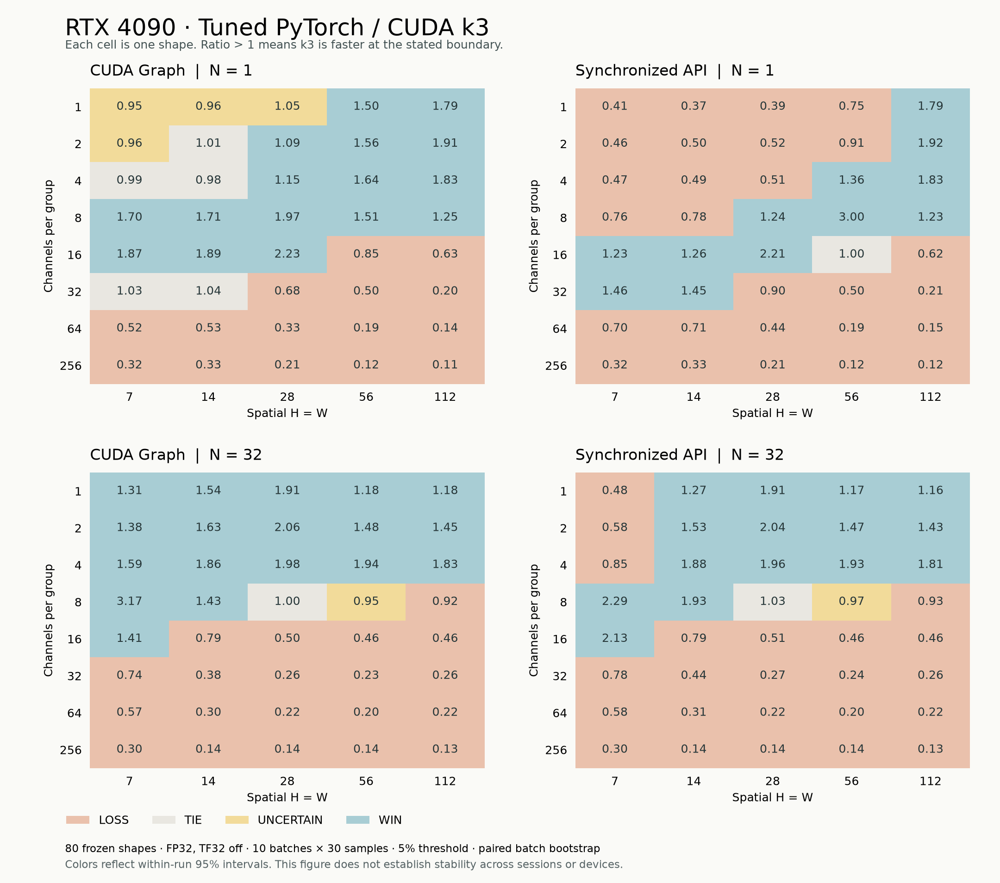

[English](README.md) | [简体中文](README.zh-CN.md)

# GroupConv Atlas

A measured performance map of forward grouped convolution: when spatial mapping, shared-memory tiles and register reuse help, and when a tuned framework remains faster.

The project combines C++, OpenMP, OpenCL, CUDA and a bounded Triton extension, developed with Codex assistance. See [contributions](docs/CONTRIBUTIONS.md) for authorship and explanation boundaries.

**Inspect first:** [evidence index](docs/evidence-index.md) · [four bilingual interview questions](docs/interview-map.md) · [latest 80-point analysis](results/rtx4090/session-20260908-vast-03/analysis-atlas/summary.zh-CN.md).
The frozen course work measures CPU and Apple M4 OpenCL. A separate RTX 4090 D
run now includes real CUDA validation, an 80-point atlas, six confirmation points,
and a ShuffleNetV2 block substitution at batches 1 and 4. See
[the historical analysis](results/rtx4090d/analysis-20260908/summary.zh-CN.md).

A subsequent RTX 4090 session completed real hardware profiling, layout/cache/transfer
boundaries, direct cuDNN, model layers, MobileNetV2 blocks, Triton check/tune/holdout,
and copy/FMA microbenchmarks. Its new 80-point 10×30 confirmation contains 129,000
samples and complete within-run intervals. See [the new analysis](results/rtx4090/session-20260908-vast-03/analysis-atlas/summary.zh-CN.md).

The frozen Apple OpenCL course package was delivered separately as a local course artifact.

## Architecture and support

Frozen shapes and precision policy → validated native/Triton calls → raw per-batch samples → paired analysis and atlas. The C ABI separates validation and dispatch from CPU, OpenCL and CUDA implementations; Python owns framework references, experiment orchestration and statistics.

All native CUDA paths are FP32, contiguous NCHW, forward-only and bias-free. B geometry means Cin=Cout, 3×3, stride/dilation 1 and padding 1; legal groups and spatial tails remain checked.

| Implementation | Contract | Latest atlas coverage |
| --- | --- | --- |
| CUDA k0 | General valid convolution geometry | 80/80 |
| CUDA k1, k3 | B geometry | 80/80 each |
| CUDA k2 | B geometry, channels/group ∈ {1,2,4} | 30/80; 50 unsupported |
| Triton | B geometry, channels/group ∈ {1,2,4}; input/weight element counts < 2³¹ | 15/40 holdout; 25 unsupported |
| CPU/OpenCL course path | Separate Apple M4 course experiment | 36 course shapes; not NVIDIA evidence |

[k1](csrc/cuda/groupconv.cu) changes spatial mapping and specializes geometry; k2 stages a shared halo; k3 reuses inputs and weights across four horizontal outputs per thread. These are controlled implementation comparisons, not isolated proof of a single causal factor. [Profile and actual SM89 code](results/rtx4090/session-20260908-vast-03/analysis-profile/mechanism-review.zh-CN.md) explain both gains and failures.

## Reproduce

The fastest check needs CMake 3.20+, C++17 and a real OpenMP runtime:

```sh
# macOS with Homebrew LLVM: export CXX="$(brew --prefix llvm)/bin/clang++"
cmake -S . -B build -DGC_ENABLE_OPENCL=OFF -DGC_ENABLE_CUDA=OFF -DCMAKE_BUILD_TYPE=Release
cmake --build build --parallel 2
ctest --test-dir build --output-on-failure
```

On macOS, Homebrew LLVM/libomp supplies OpenMP; `./run.sh cpu` selects this toolchain when available. Python checks additionally need NumPy, PyTorch and pytest. `requirements-lock.txt` records the measured macOS environment; Linux CUDA uses `requirements-cuda.txt` and its matching development image.

```sh
python3 -m venv .venv
.venv/bin/python -m pip install -r requirements-lock.txt
./run.sh cpu
./run.sh check --backend cpu --output results/correctness.json
# macOS GPU: ./run.sh opencl, then check --backend all
# Linux RTX 4090: ./run.sh cuda -DCMAKE_CUDA_ARCHITECTURES=89
# then: ./run.sh check --backend cuda
```

An explicitly requested unavailable backend fails. `all` records absent CUDA as NOT_RUN; CPU and OpenCL remain required. CUDA performance/profiling instructions are in [the validation protocol](docs/execution/cuda-validation.md). The maintained source tree and exact measured numerical source are distinct: the public export includes `evidence/measured-source-031887c/` and `evidence/measured-source-identity.json` with the published subset and original hashes.

Audit an exported package without a GPU:

```sh
python scripts/audit_public_evidence.py --root .
```

The export generates `docs/PUBLIC_EVIDENCE.md` describing redaction, original/public hashes and the retained evidence boundary. The CPU CI workflow runs native correctness and sanitizer builds; GPU evidence comes from the archived real-device experiments.

## Contract and measurement

Stage B uses FP32 NCHW, no bias, equal input/output channels, 3×3 kernel,
stride 1, padding 1, dilation 1, all legal groups and spatial tails. CPU and CUDA
naive support more general geometry; dedicated kernels return UNSUPPORTED outside
their declared subset. `configs/` contains 36 course shapes, 80 atlas shapes and
disjoint tuning/holdout IDs. No kernel silently falls back to another implementation.

Supported outputs are checked against same-policy FP32 PyTorch. The CUDA
correctness suite uses an independent full-output FP64 oracle for boundary
shapes and fixed FP64 reference points for course/batch-4 shapes. Atlas timings
validate each supported full output against the FP32 CUDA framework reference.
Timings preserve raw batches and separate synchronized API, OpenCL event, and explicit
host/device buffer copy costs. Apple unified-memory copies are not PCIe transfer rates.
CPU references and CPU PyTorch timings use an isolated process to keep the bundled
OpenMP runtime separate from the native CPU runtime; IPC is excluded from those
measurements. In CUDA runs, the default framework baseline shares the shape worker
with native calls; the tuned baseline has its own process to isolate algorithm caches.

The default 5×30 samples are descriptive. Confirmed win/tie/loss classification requires
10 independent paired batches and the frozen confidence rule. No claim of cuDNN
superiority follows from CPU/OpenCL results.

On the 80 CUDA atlas shapes, the descriptive geometric mean speedup of k3 over
k0 is 3.919 for graph-device time and 3.040 for eager API time. Against tuned
PyTorch, those ratios are 0.789 and 0.645: k3 does not improve the aggregate.
The tested ShuffleNetV2 block also shows no measured eager benefit. These
comparisons use the ratio of per-shape median batch medians; graph and eager
conditions remain separate. Full denominators and paired confirmation results
are in [the analysis](results/rtx4090d/analysis-20260908/summary.zh-CN.md).
Nsight Compute counters were denied on that RTX 4090 D host. The subsequent RTX 4090
session passed the counter gate and audited 30 formal captures across eight shapes.
Its k3/k0 graph speedup is 3.8718; tuned PyTorch/k3 is 0.7384 for graph time and
0.6448 for synchronized API time. These belong to the new device and protocol;
they do not establish cross-session stability. Code, counters and measured-binary
SASS support bounded mechanism analysis; a sustainable hardware roofline is not established.



The latest Graph comparison against tuned PyTorch contains 34 WIN, 35 LOSS, 6 TIE and 5 UNCERTAIN points; synchronized API contains 27/50/2/1. These classifications use ten paired batches, 95% bootstrap intervals and a 5% practical threshold. The older RTX 4090 D 5×30 atlas, its six-point confirmation, and Apple course measurements remain separate evidence sets.

MobileNetV2 N=4 improves the complete block under Graph timing by 1.13849×, while synchronized API ratios are 0.66465 at N=1 and 0.67902 at N=4 (slower). Random-weight output checks do not establish task accuracy or whole-network speed. Direct cuDNN closes 32/32 planned layout/path units. Triton closes check/tune/holdout on the new GPU, but its five-batch, separately run suites remain descriptive and UNCERTAIN. Ascend has no implementation or NPU measurement. [Supplemental evidence](docs/evidence-index.md) retains all denominators.

## Provenance and authorship

Source was developed with Codex assistance. Code review, numerical tests and recorded
experiments provide implementation evidence; the owner attests to topic selection, design, code modification, experiment configuration, result checking and independent explanation. This testimony has not been independently assessed in an interview. Original kernel source was written for this project.
External sources and dependency licenses are recorded in [REFERENCES](docs/REFERENCES.md). Project code uses [MIT](LICENSE); project-owned data and figures use [CC BY 4.0](DATA_LICENSE). [NOTICE](NOTICE) preserves attribution and third-party boundaries. Public/course exports
exclude private job evidence, credentials, local virtual environments and machine paths.

See [中文说明](README.zh-CN.md) and [the evidence index](docs/evidence-index.md).
