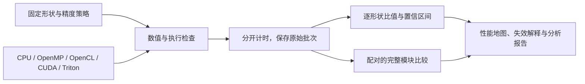

# groupconv-atlas

逐形状量清内核在哪里变快，再检查收益能否留在完整模块里。

[](https://github.com/LucisZhang/groupconv-atlas/actions/workflows/cpu.yml)
[English / 中文对照](README.md) · [纯中文](README.zh-CN.md)

## 为什么做

GroupConv Atlas研究自定义分组卷积内核何时值得使用。我实现并比较四个CUDA版本，配套CPU/OpenMP、Apple OpenCL参考和Triton子集，把完整输出校验、原始计时批次、不支持项与退化结果放进同一套实验。主要发现并不单向：寄存器复用改进了直接CUDA实现，但在完整Atlas上仍未超过调优PyTorch。开发与实验使用Codex辅助，参与范围见[个人贡献](docs/CONTRIBUTIONS.md)。

## 快速开始

克隆这个公开仓库后，第一条命令只需Python 3.9+：它核对文件哈希，从129,000条原始样本复算批中位数、逐形状比值与汇总比值。GPU实验与bootstrap区间的重新生成属于另外的流程。

```sh
python3 scripts/audit_public_evidence.py --root . --require-license

# CMake 3.20+、C++17与OpenMP运行时
./run.sh cpu
ctest --test-dir build --output-on-failure
```

macOS下，`run.sh`会选用已安装的Homebrew LLVM/libomp。CPU CI另跑内存与未定义行为检查。Python输出检查与GPU重跑需要对应依赖和设备，见[验证指南](docs/execution/cuda-validation.md)、[macOS依赖记录](requirements-lock.txt)和[Linux CUDA依赖](requirements-cuda.txt)。

## 核心结果

<!-- src: configs/atlas.json; results/rtx4090/session-20260908-vast-03/analysis-atlas/analysis.json -->

本轮RTX 4090覆盖80个形状、6个实现，共430 PASS、50 UNSUPPORTED；每个支持项采集10批、每批30个样本。不支持项全部来自k2的声明范围。主表固定FP32、连续NCHW、输入输出通道相等、3×3、步长与膨胀率1、填充1、无bias。

| 对照 | Graph图内设备 | 同步API调用 |
| --- | ---: | ---: |
| 直接CUDA k0 / 自定义k3 | **3.8718×** | **3.4490×** |
| 调优PyTorch / 自定义k3 | **0.7384×** | **0.6448×** |
| MobileNetV2原模块 / 替换后模块，N=4 | **1.13849×** | **0.67902×** |

比值为基线时间除以候选时间，大于1表示候选更快。前两行对80个形状取几何平均；每个形状先取批中位数的中位数，再求基线／候选比值。第三行测的是随机权重的完整MobileNetV2模块，仅替换其中一个卷积。[Atlas数值](results/rtx4090/session-20260908-vast-03/analysis-atlas/analysis.json) · [模块数值](results/rtx4090/session-20260908-vast-03/analysis-supplemental/module-n4.json)。


图1保留全部形状。对调优PyTorch，Graph为34 WIN、35 LOSS、6 TIE、5 UNCERTAIN；同步API依次为27、50、2、1。分类使用10个配对批次、95% bootstrap区间和5%实际差异阈值，只描述本轮内部变化，不代表跨会话稳定性。[完整矩阵与方法](results/rtx4090/session-20260908-vast-03/analysis-atlas/summary.zh-CN.md)。

## 交付内容



C ABI负责参数、缓冲区、stream契约和后端分派，Python负责框架参考、实验编排与配对统计。完整输出的FP32检查与独立FP64检查分别记录覆盖范围；Atlas每个支持项核对64个FP64参考点，并非完整输出FP64。

| 实现 | 设计 | 支持范围 |
| --- | --- | --- |
| k0 | 通用几何、输出索引直接映射 | Atlas 80/80 |
| k1 | 空间映射与几何专用化 | Atlas 80/80 |
| k2 | 协作加载共享halo | Atlas 30/80；每组通道1、2、4 |
| k3 | 每线程四个水平输出复用 | Atlas 80/80 |
| Triton | 独立调优的内核子集 | holdout 15/40；每组通道1、2、4，其余25不支持 |

k1–k3和Triton采用前述主表几何；Triton另要求输入与权重元素数小于2³¹。超出范围的请求返回明确状态，实际契约见[CUDA源码](csrc/cuda/groupconv.cu)、[Triton支持契约](backends/triton/__init__.py)与[执行测试](tests/native_cuda.cu)。

## 收益在哪里失效

**共享存储有成本。** 六个支持的Nsight代表点中，k2只在两个点比k1短，另外四个更长。共享halo带来输入复用，也增加协作加载和同步；实测二进制保留了这些操作。计数器与代码能解释其中的取舍，但不能把慢幅单独归因于bank conflict或barrier。这里比较的是单次profile采集，不能替代普通计时的置信判定。[计数器与实际SM89机器码](results/rtx4090/session-20260908-vast-03/analysis-profile/mechanism-review.zh-CN.md)。

**图内收益没有自动转成调用收益。** N=4模块保留了图内收益，同步调用却更慢。N=1的Graph比值为1.04879，判为TIE；API为0.66465，判为LOSS。分配、调用与模块周边工作都会影响结果，因此要分别测量，不能从单个内核直接推算应用延迟。随机权重输出一致也不证明任务准确率或整网提速。[配对模块分析](results/rtx4090/session-20260908-vast-03/analysis-supplemental/summary.zh-CN.md)。

## 扩展实验

| 实验 | 已记录结果 | 查看 |
| --- | --- | --- |
| 硬件profiling | 8个形状、30个正式采集组合，另有2个k2不支持项 | [Nsight摘要](results/rtx4090/session-20260908-vast-03/analysis-profile/summary.zh-CN.md) |
| 直接cuDNN | 32/32个计划内布局／路径单位通过 | [Frontend分析](results/rtx4090/session-20260908-vast-03/analysis-supplemental/frontend-order-corrected.json) |
| 布局／缓存／往返 | 276 PASS、12 UNSUPPORTED | [边界分析](results/rtx4090/session-20260908-vast-03/analysis-supplemental/boundaries.json) |
| 模型提取层 | 36 PASS、28 UNSUPPORTED、8 NOT_RUN | [模型层分析](results/rtx4090/session-20260908-vast-03/analysis-supplemental/models.json) |
| Triton check/tune/holdout | 调优与holdout隔离；五批比较保持UNCERTAIN | [Triton摘要](results/rtx4090/session-20260908-vast-03/analysis-triton/summary.zh-CN.md) |

Triton只覆盖holdout中的15个点，分开执行的五批套件不支持配对统计胜出。微基准和机器码审查尚未确立可持续roofline；Ascend尚无源码、模拟或NPU结果。

旧RTX 4090 D五批主表与六点复测保留在[历史分析](results/rtx4090d/analysis-20260908/summary.zh-CN.md)，Apple M4课程包另行交付。它们的设备、采样和计时口径不与本轮RTX 4090合并。

## 从哪里读

| 路径 | 内容 |
| --- | --- |
| [`csrc/`](csrc/) | 原生实现、C ABI与参数校验 |
| [`bench/`](bench/) | 框架参考、计时、模块替换与统计 |
| [`backends/triton/`](backends/triton/) | Triton实现与支持契约 |
| [`configs/`](configs/) | 固定形状与测量协议 |
| [`results/`](results/) | 原始样本、图表与分析 |
| [`scripts/audit_public_evidence.py`](scripts/audit_public_evidence.py) | 复算公开Atlas比值 |
| [`docs/evidence-index.md`](docs/evidence-index.md) | 按设备查结果与原始文件 |
| [`docs/interview-map.md`](docs/interview-map.md) | 四个双语问题与代码／结果定位 |

`evidence/`保留实测数值源码子集及原始文件哈希，[公开文件说明](docs/PUBLIC_EVIDENCE.md)记录导出范围。当前维护源码与当时的测量快照分别记录，后续代码修改不会改变旧实验的源码归属。

## 个人贡献与复用

我负责选题、方案设计、代码修改、实验配置与结果核对，开发过程使用Codex辅助。独立讲解能力为本人自述，尚无独立考核；上游工具和已有优化方法的归属见[贡献说明](docs/CONTRIBUTIONS.md)。

本项目代码采用[MIT](LICENSE)，项目自有实验数据与图表采用[CC BY 4.0](DATA_LICENSE)，复用时按[NOTICE](NOTICE)保留署名。依赖与外部资料沿用各自条款，见[参考资料](docs/REFERENCES.md)。
